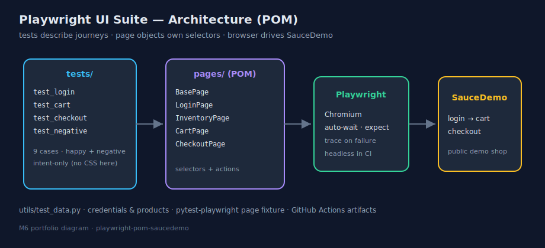
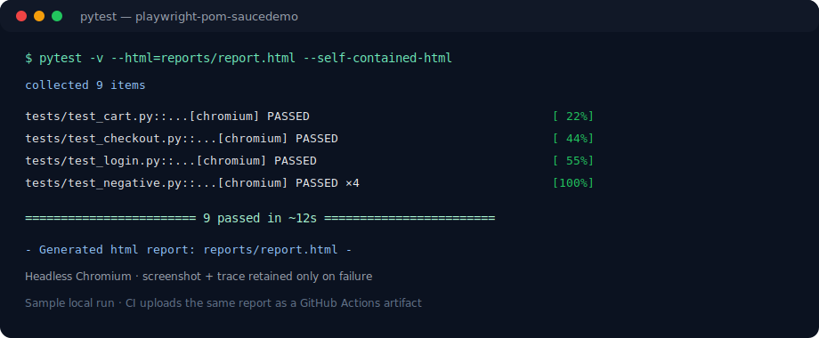
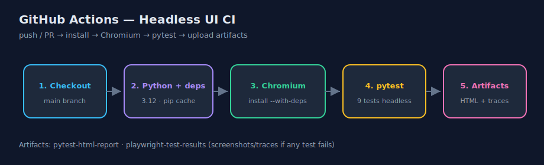

# Playwright UI Suite — SauceDemo (POM)

[](https://github.com/nilima-satapathy/playwright-pom-saucedemo/actions/workflows/ci.yml)
[](https://www.python.org/)
[](https://playwright.dev/python/)
[](./MILESTONES.md)
[](./tests)

> Maintainable **browser UI automation** in Python — Page Object Model, end-to-end journeys, negative login, failure traces, and headless GitHub Actions CI.

**Author:** [Nilima Satapathy](https://github.com/nilima-satapathy) · Portfolio board: **[ai-career-journey](https://github.com/nilima-satapathy/ai-career-journey)**

| | |
|--|--|
| **Target app** | [SauceDemo](https://www.saucedemo.com) (public practice shop) |
| **Stack** | Python · Playwright · Pytest · pytest-playwright · pytest-html · GitHub Actions |
| **Status** | ✅ **Project complete** (Milestones 1–6) |
| **Suite size** | **9** automated UI tests |

---

## Why this project

Portfolio project for **SDET / QA Automation / AI Test Engineer** roles. Most AI-quality job descriptions still expect solid UI automation. This suite shows:

- **Page Object Model** — selectors live in `pages/`, not in test bodies  
- **Real user journeys** — login → cart → checkout → logout  
- **Negative paths** — wrong password, locked user, missing fields  
- **Debuggable failures** — screenshot + Playwright **trace** on fail  
- **CI on every push** — headless Chromium + downloadable HTML report  

Pairs with Project 1 ([API automation](https://github.com/nilima-satapathy/api-automation-pytest)): APIs first, then the browser layer.

---

## Architecture



```text
tests/  →  page objects (pages/)  →  Playwright (Chromium)  →  SauceDemo
   │
   └─ utils/test_data.py   (users, products, checkout fields)
```

---

## Features

| Area | What you get |
|------|----------------|
| **POM** | `BasePage`, `LoginPage`, `InventoryPage`, `CartPage`, `CheckoutPage` |
| **Journeys** | Login, single/multi cart, full checkout, checkout + logout |
| **Negatives** | Bad password, locked-out user, empty username/password |
| **Stability** | Playwright auto-wait + `expect` assertions |
| **Failure debug** | Screenshot + trace only on fail (`test-results/`) |
| **Reporting** | Local + CI **pytest-html** self-contained report |
| **CI** | Headless Chromium on push/PR · HTML + trace artifacts · green badge |

---

## Quick start (Windows)

```powershell
git clone https://github.com/nilima-satapathy/playwright-pom-saucedemo.git
cd playwright-pom-saucedemo
python -m venv .venv
.\.venv\Scripts\Activate.ps1
pip install -r requirements.txt
playwright install chromium
pytest
```

### Headed mode (watch the browser)

```powershell
pytest --headed
```

### HTML report

```powershell
mkdir reports -Force
pytest --html=reports/report.html --self-contained-html
```

Open `reports/report.html` in any browser.

### Optional base URL

```powershell
$env:SAUCEDEMO_BASE_URL = "https://www.saucedemo.com"
pytest
```

> **Note:** Tests hit a public demo site. Rare network blips can make a single run flaky; re-run if SauceDemo is briefly unreachable.

---

## Sample results



| File | Focus | Cases |
|------|--------|------:|
| `tests/test_login.py` | Successful login | 1 |
| `tests/test_cart.py` | Add 1–2 items to cart | 2 |
| `tests/test_checkout.py` | Complete order + logout | 2 |
| `tests/test_negative.py` | Failed login scenarios | 4 |
| **Total** | | **9** |

### Failure artifacts

On a failed test, Playwright writes under `test-results/`:

- screenshot (PNG)  
- **trace** (ZIP) — step-by-step browser replay  

```powershell
playwright show-trace test-results\<folder>\trace.zip
```

---

## Continuous Integration



On every **push** and **pull request** to `main`:

1. Install Python dependencies  
2. Install Chromium (`playwright install chromium --with-deps`)  
3. Run the full suite **headless**  
4. Upload artifacts:
   - `pytest-html-report`
   - `playwright-test-results` (if any failures produced traces)

- Workflow: [`.github/workflows/ci.yml`](./.github/workflows/ci.yml)  
- Actions: [CI runs](https://github.com/nilima-satapathy/playwright-pom-saucedemo/actions)  
- Download report: open a green run → **Artifacts** → `pytest-html-report`

---

## Project structure

```text
playwright-pom-saucedemo/
├── .github/workflows/ci.yml   # Headless CI + artifacts
├── docs/assets/               # Portfolio diagrams (README images)
├── MILESTONES.md              # Milestone log + tags
├── README.md
├── requirements.txt
├── pytest.ini                 # screenshot/trace on failure
├── pages/
│   ├── base_page.py
│   ├── login_page.py
│   ├── inventory_page.py
│   ├── cart_page.py
│   └── checkout_page.py
├── tests/
│   ├── conftest.py            # base_url fixture
│   ├── test_login.py
│   ├── test_cart.py
│   ├── test_checkout.py
│   └── test_negative.py
└── utils/
    └── test_data.py           # users, products, form data
```

---

## Milestone journey (complete)

| # | Milestone | Tag |
|---|-----------|-----|
| 1 | Playwright scaffold + first login test | `milestone-1` |
| 2 | Page Object Model refactor | `milestone-2` |
| 3 | Cart + checkout journeys | `milestone-3` |
| 4 | Negative login + screenshot/trace on fail | `milestone-4` |
| 5 | Headless GitHub Actions CI | `milestone-5` |
| 6 | README polish + portfolio assets | `milestone-6` |

Details: **[MILESTONES.md](./MILESTONES.md)** · Releases: [GitHub Releases](https://github.com/nilima-satapathy/playwright-pom-saucedemo/releases)

---

## Interview talking points

1. **Why POM?** Selectors and page actions live in one class; UI renames don’t rewrite every test.  
2. **Playwright auto-wait** — fewer flaky “element not found” failures than raw sleeps.  
3. **Journey design** — assert after each major step (login → cart → overview → complete).  
4. **Negative tests** — prove the app fails safely (error banner, stay on login).  
5. **Trace on failure** — CI can upload a full browser replay, not only a red X.  
6. **Headless CI** — same suite as local, no GUI on the runner; use `--with-deps` on Linux.  
7. **Test data module** — credentials/products centralized for reuse and clarity.  
8. **Bridge skill** — UI automation remains expected on SDET / AI Test JDs alongside API and eval work.

---

## Design choices

| Choice | Why |
|--------|-----|
| SauceDemo | Free, stable practice app; recruiters recognize it |
| POM over raw selectors in tests | Maintainable as the suite grows |
| pytest-playwright | Standard `page` fixture; simple headed/headless toggles |
| Trace only on failure | Cheap green runs; rich debug when something breaks |
| Self-contained HTML report | Offline viewing; easy CI artifact |

---

## License / use

Portfolio project for learning and job applications. Feel free to fork for practice.

---

*Built as Project 2 of my [AI career journey](https://github.com/nilima-satapathy/ai-career-journey) · Nilima Satapathy*
